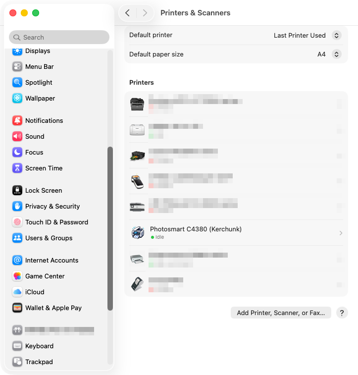
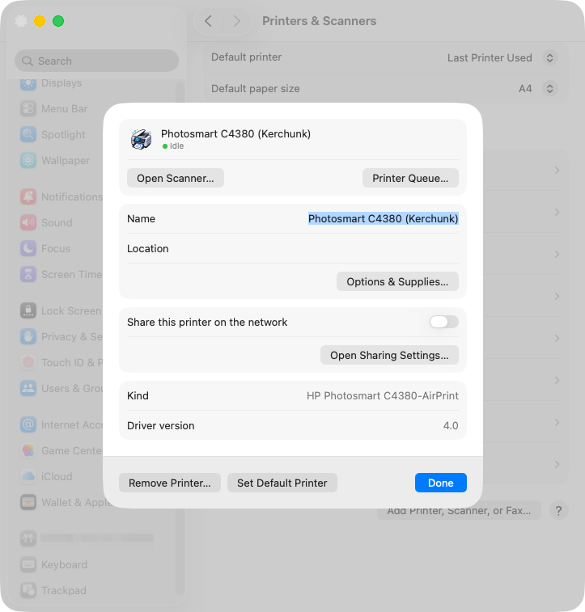
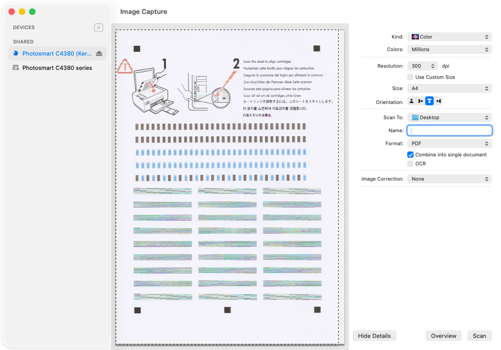
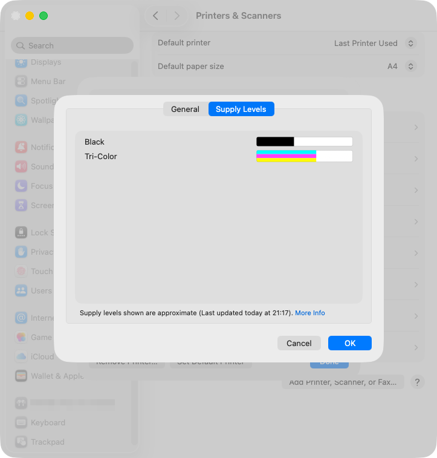
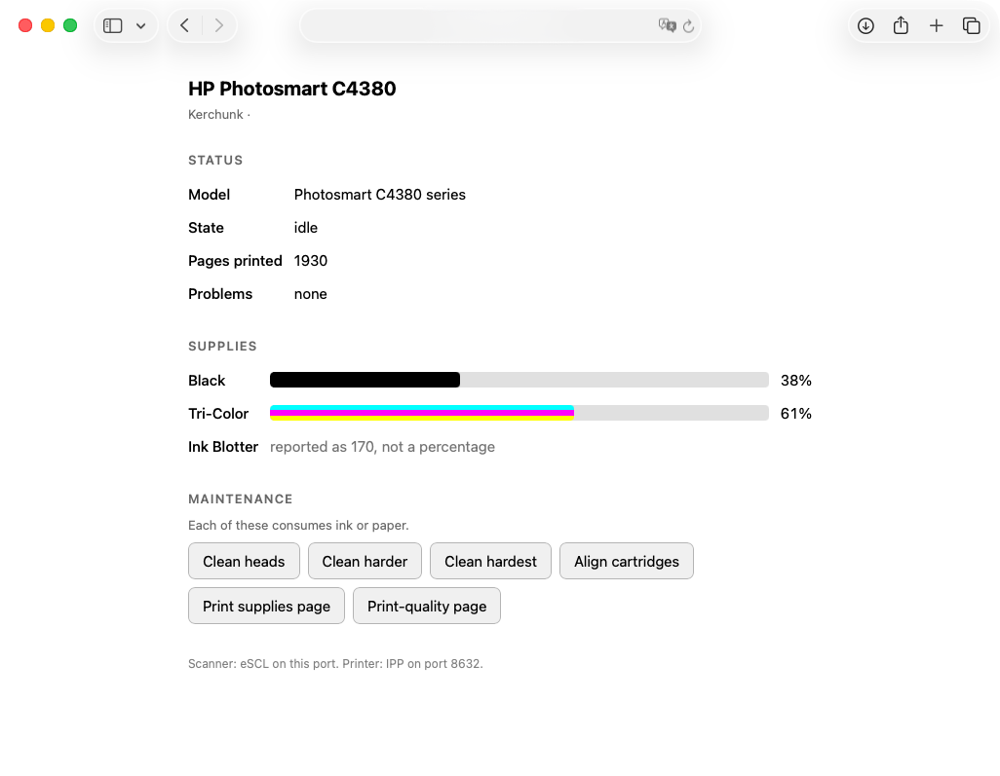

# Kerchunk

*The sound a flatbed makes when it still works.*

Keeps a 2007 HP Photosmart C4380 all-in-one **printing and scanning from
modern macOS and iOS** — as an AirPrint printer and an AirScan scanner — with
no HP software anywhere in the path. No vendor driver, no HPLIP, no SANE, no
Rosetta. Runs on a Raspberry Pi (recommended) or on the Mac itself.

The printer is unmodified. Everything here talks to it over the network in
protocols it has spoken since 2007.

## What works

| | |
|---|---|
| Printing | AirPrint / IPP Everywhere, from macOS, iPhone and iPad |
| Scanning | eSCL / AirScan — Image Capture, Preview, mobile scan apps |
| Colour | 1-bit, 8-bit grey, 24-bit colour, and 48-bit colour |
| Formats | JPEG, PNG, PDF |
| Status | paper out, jam, door open, ink levels, page count |
| Maintenance | head cleaning, cartridge alignment, internal pages |
| Control page | `http://<host>:8633/` — status, supplies, maintenance |

It appears as an ordinary driverless printer and scanner. The "Kind" is
`HP Photosmart C4380-AirPrint`, and there is no driver installed:

<p align="center">
  
  
</p>

## Requirements

- An HP Photosmart C4380 **on the network** (not USB), switched on.
- A Raspberry Pi running Debian 12/13, or a Mac. Anything that runs Python 3
  and Ghostscript will do; a Pi 4 is comfortable.
- `ghostscript`, `cups-ipp-utils`, `avahi-daemon`, `avahi-utils`, `python3`.
  The Pi installer fetches these. On a Mac, `brew install ghostscript` and
  the rest is already there.

Everything in `bin/` is standard-library Python or POSIX shell. Nothing is
compiled, signed, or notarised, so there is nothing to expire.

## Quick start

On a Raspberry Pi:

    git clone <this repo> kerchunk && cd kerchunk
    bin/find-printer.sh                  # or set PRINTER_IP in etc/kerchunk.conf
    sudo deploy/pi/install.sh

On a Mac instead:

    bin/find-printer.sh
    deploy/macos/install.sh              # two launchd agents, no sudo

The printer and scanner then advertise themselves; macOS and iOS find them
without any driver. See **Running it on a Mac instead** for why the Pi is the
better host.

## Scope, and what this is not

- **Tested on exactly one printer.** Everything here was verified against a
  single C4380. HPLIP's database lists 164 models that use the same SCL scan
  protocol, all of them needing no proprietary plugin, and the print side
  should suit any PCL3GUI device Ghostscript can drive — but that is
  inference, not testing. Expect to adapt.
- **Not maintained.** This is published because the findings were expensive
  to obtain and may save someone else the work, not as a supported product.
  Fork it freely.
- The print side is not novel: Ghostscript to PCL3GUI over port 9100 is known
  art. The scanning work is the contribution — see
  `docs/scanning-findings.md`.

## Licence and provenance

GPL-2.0-or-later; see `LICENSE`.

No HPLIP code is included here. The protocols were learned by **reading**
HPLIP's GPLv2+ sources — `scan/sane/{scl,sclpml,mfpdtf}.c`, `io/hpmud/jd.c`,
`base/{pml,maint}.py`, `prnt/pcl.py` — and reimplemented from the wire
formats they document. Protocol facts are not copyrightable and nothing was
copied verbatim, so a permissive licence would be defensible; GPL is chosen
because the lineage is real and matching it costs nothing.

## The problem

The existing queue `Photosmart_C4380_series` prints through
`/Library/Printers/hp/cups/Photosmart.driver` — a vendor CUPS filter plus a 1 MB
vendor PPD. Two independent clocks are running out on it:

1. **Driver deprecation.** macOS 26 deprecated third-party printer drivers
   (vendor PPDs + CUPS filter binaries under `/Library/Printers`). Apple's forward
   path is driverless only: AirPrint / IPP Everywhere. This is the warning.
2. **Rosetta.** That filter is `Mach-O 64-bit executable x86_64` — on Apple Silicon
   it only runs under Rosetta 2, which Apple is also winding down.

The scanner has the same issue: `/Library/Image Capture/Devices/HP Scanner 3.app`
is a legacy ICA plugin in the same deprecation bucket.

## Why "just make it driverless" isn't a setting

The C4380 has no IPP and no AirPrint. It advertises only `_pdl-datastream._tcp`
(raw JetDirect, port 9100) and understands only HP's **PCL3GUI** raster language.
Something must convert PDF → PCL3GUI. The only real question is *where that
converter runs*. This project runs it on the Mac.

## Architecture

```
App  →  driverless IPP queue (ipp://localhost:8632/ipp/print)
          →  /usr/bin/ippeveprinter          Apple's own binary, arm64, ships with macOS
             →  bin/pdf2c4380.sh             our print command
                →  gs -sDEVICE=chp2200       Ghostscript, arm64 → PCL3GUI
                   →  socket://<printer-ip>:9100
```

macOS sees an **IPP Everywhere** printer. No vendor PPD, nothing under
`/Library/Printers`, no x86_64 code — entirely on Apple's supported side.

## Verified so far (2026-08-21)

Established by testing on this machine, not assumed:

- `/usr/bin/ippeveprinter` is present, arm64, dated 21 May 2026 (current OS component).
- Its command contract: **job PDF arrives as `argv[1]`**, stdin is empty, and the
  command's **stdout is forwarded to the `-D` device URI**. 26 `IPP_*` env vars
  carry job options.
- `lpadmin -m everywhere` succeeds against the shim; the generated queue reports
  `*NickName: "... - IPP Everywhere"` with **zero** `/Library/Printers` references.
- End-to-end print through the real macOS queue produced valid PCL3GUI — correct
  UEL header, `@PJL ENTER LANGUAGE=PCL3GUI`, `ESC*r2550S` raster width, one
  raster block per page — and the page printed correctly on the physical printer.

### Ghostscript device selection

Only some gs HP devices emit real raster in this build:

| device | output (4-page letter) | notes |
|---|---|---|
| `chp2200` | 2.4 MB | **chosen** — emits explicit `@PJL ENTER LANGUAGE=PCL3GUI` |
| `cdj970` | 6.3 MB | fallback, PCL3GUI mode-9 compression |
| `cdj890` / `cdj850` | 4.6 MB | fallback |
| `cdj550` | 4.9 MB | oldest, safest fallback |
| `pcl3`, `hpdj*` | 80 bytes | **broken/stubbed in this build — do not use** |

If `chp2200` prints garbage or nothing on real hardware, change `GS_DEVICE` in
`etc/kerchunk.conf` and work down that list.

## Confirmed on real hardware

**It prints correctly.** The printer was identified via its
embedded web server title and its reverse DNS name). A test page through the
full stack — macOS queue → ippeveprinter → `gs -sDEVICE=chp2200` → port 9100 —
came out correct. So `chp2200` is the right device and the HPLIP `hpcups` build
is **not** needed.

## AirPrint from iPhone / iPad

`ippeveprinter` also advertises over DNS-SD, so the C4380 gains AirPrint it never
had. Three things are required, and none is on by default:

1. **`_universal` subtype.** iOS browses `_universal._sub._ipp._tcp`, but
   `ippeveprinter` defaults to subtype `_print`. Fixed with `-r _print,_universal`.
   (Note: `dns-sd -B _ipp._tcp,_universal local` is the syntax that verifies this;
   `ippfind _universal._sub._ipp._tcp` silently finds nothing even when correct.)
2. **`image/urf` in the advertised formats.** iOS requires `image/urf` in the TXT
   `pdl` key, and refuses to classify the service as a printer without it — it will
   still show up in a generic mDNS browser, which makes this look like a network
   problem when it isn't.
3. **A `URF` capability key in the TXT record**, which `ippeveprinter` derives
   automatically once `image/urf` is in `-f`.

So the entire fix is: `-r _print,_universal` and `-f application/pdf,image/jpeg,image/urf`.

### Do NOT use -a to inject URF

The obvious-looking route is `-a attrs.conf` with `ATTR keyword urf-supported ...`.
It works, and it breaks two things:

- **`-a` is mutually exclusive with `-M`, `-m`, `-f` and `-s`.**
- **`-a` suppresses 39 built-in attributes**, including `media-col-database` and
  `print-quality-supported`. iOS then fails every job with
  `client-error-attributes-or-values-not-supported (Unsupported media-col
  collection value.)`, and the print dialog loses its quality selector.

Listing `image/urf` in `-f` gets URF advertised while keeping all the defaults.

iOS sends `application/pdf` for the actual job even though `image/urf` is offered,
so Ghostscript handles it normally. `bin/pdf2c4380.sh` detects Apple Raster and
PWG Raster explicitly and fails with a clear message if that ever changes.

Note the Mac must be awake for the phone to print.

Known rough edge: gs currently follows the PDF's own page size rather than the
IPP `media` attribute (a letter PDF produced `ESC*r2550S` = letter width even with
`-sPAPERSIZE=a4`). Add `-dFIXEDMEDIA` if the IPP media selection must win.

## Setup

```sh
# 1. Power the printer on, then find it
bin/find-printer.sh                 # records PRINTER_IP in etc/kerchunk.conf

# 2. Start the shim (foreground, for testing)
bin/start-server.sh

# 3. In another shell, add the driverless queue
bin/install-queue.sh

# 4. Print something
lp -d Photosmart_C4380_Native somefile.pdf
```

Once it prints correctly, install the launchd agent so the shim always runs:

```sh
cp etc/local.photosmart-c4380.plist ~/Library/LaunchAgents/
launchctl load ~/Library/LaunchAgents/local.photosmart-c4380.plist
```

Then, and only then, delete the legacy queue that carries the warning:

```sh
lpadmin -x Photosmart_C4380_series
```

## Layout

| path | purpose |
|---|---|
| `etc/kerchunk.conf` | printer IP, gs device, resolution, ports — shared by print and scan |
| `bin/pdf2c4380.sh` | the print command: PDF → PCL3GUI |
| `bin/start-server.sh` | launches `ippeveprinter` with the right flags |
| `bin/find-printer.sh` | mDNS discovery + subnet sweep for port 9100 |
| `bin/install-queue.sh` | `lpadmin -m everywhere` |
| `bin/scl.py` | SCL scanner client — talks to port 9290 directly |
| `bin/printer_status.py` | SNMP status: jams, paper, ink, page count |
| `bin/maintenance.py` | head cleaning, alignment, internal pages |
| `bin/set-mac-icon.sh` | macOS-local printer icon fallback |
| `deploy/macos/` | launchd agents for running it on a Mac |
| `bin/escl-server.py` | eSCL/AirScan server that fronts `scl.py` |
| `share/icons/` | device icons shown in the print and scan pickers |
| `deploy/pi/` | systemd units + installer for the Raspberry Pi |
| `docs/scanning-findings.md` | how the scan protocol was identified |
| `var/log/print.log`, `var/log/escl.log` | per-job logs |

## Scanning — working

The scanner turned out to be far more open than the printer. HPLIP's model
database lists the C4380 as `scan-type=1` (SCL) with **`plugin=0`**: no
proprietary blob, unlike the `soap`/`marvell`/`orblite` families. It answers
SCL on TCP **9290** directly, so no vendor code is needed at all.

`bin/scl.py` implements that protocol; `bin/escl-server.py` wraps it in an
eSCL/AirScan service so Apple's own `AirScanScanner.app` — a universal binary
in `/System`, not a third-party plugin — drives it. Image Capture, Preview and
mobile scan apps then treat it as any other network scanner:



    printing   ippeveprinter  →  gs → PCL3GUI      →  :9100
    scanning   escl-server.py →  SCL → JPEG        ←  :9290

Verified on the real device:

- capabilities: 8.5" × 11.69" platen, 75–1200 dpi, flatbed only, no ADF
- 300 dpi colour full page: 2550×3507 JPEG in ~36 s
- 150 dpi grayscale via the full eSCL job flow, delivered as PDF
- Bonjour `_uscan._tcp` advertised and resolvable

Notes:

- The device reports **all geometry in 1/300 inch**, not the 1/720 the HPLIP
  sources suggest — and eSCL uses 1/300 too, so regions pass straight through.
- Its start-of-page record is **all zeros**; the SCL inquiries are the real
  source of truth for width/height. HPLIP calls this "simulated image headers".
- `SET_CONTRAST` is **unsupported** and pushes an error that aborts the job.
  It is only sent if the device admits to supporting it.
- **The JPEG knob is a compression factor, not a quality one** — higher means
  blockier. HPLIP's `SAFER_JPEG_COMPRESSION_FACTOR` of 10 is a workaround for
  a firmware assert on the OfficeJet 600 series, not a quality default.
  Measured here at 75 dpi colour on one page:

      factor   0 -> 406 kB     factor  50 ->  43 kB
      factor   5 -> 134 kB     factor  75 ->  35 kB
      factor  10 ->  98 kB     factor  90 ->  31 kB
      factor  25 ->  62 kB     factor 100 ->  30 kB

  The config exposes this inverted, as `SCAN_JPEG_QUALITY` (higher is better),
  defaulting to 100. A 300 dpi colour page is then ~6.7 MB rather than ~260 kB.

- **Lineart is supported**, via PNG and PDF. The device returns raw 1-bit
  raster in that mode, never JPEG. PNG stores 1 bpp natively — same byte-padded
  rows, and the same polarity, since the scanner sets a bit for white and PNG
  greyscale treats 0 as black — so the rows embed unchanged. PDF takes the same
  raster deflated. A 150 dpi page is ~54 kB either way, against 1.5 MB for the
  greyscale JPEG equivalent. `BlackAndWhite1` asked for *as* `image/jpeg` is
  contradictory, so that combination is scanned greyscale and logged.

- **Sharpening is real firmware**, unlike contrast: the device reports a
  -128..127 range and the effect is plainly visible (a 150 dpi grey page grew
  from 1.40 MB to 1.83 MB going from 0 to 127, i.e. genuine added detail).
  Exposed as `SCAN_SHARPEN` and over eSCL as `scan:SharpenSupport`.
  HP's other enhancement options have **no SCL equivalent** and are done in
  HP's own driver software, so they are not available here: Descreen,
  Colour Restoration, Adaptive Lighting.

- **48-bit colour ("billions of colours") works**, with caveats. The device
  accepts data widths 24, 36 and 48 and rejects 30 and 42; greyscale is 8-bit
  only. But 48-bit is refused below 300 dpi — only the native optical steps
  300 / 600 / 1200 are allowed — *even though the resolution inquiry still
  reports a 75-1200 range*, so the inquiry cannot be trusted here.

  It is also slow and bulky, because the device JPEG-encodes only
  8-bit-per-channel data: a 300 dpi page is 53,657,100 bytes of raw raster and
  took **318 s** to transfer, against 36 s for the 24-bit JPEG. Offered as
  eSCL `RGB48`, delivered as 16-bit PNG or PDF, and never used unless asked
  for. The 16-bit samples arrive **little-endian** and are byte-swapped on the
  way out, since PNG and PDF both read them big-endian; that was established
  by measuring which byte varies smoothly along a scanline.

- The scan channel answers `01` instead of `00` when it has not finished
  releasing the previous session, so back-to-back scans need a retry — hpmud
  hits the same thing. `scl.Scanner` retries rather than failing the job.

### Replacing HPScanner.app directly?

Tempting, but it is the one option that does not solve the problem: an ICA
plugin is a compiled bundle in `/Library/Image Capture/Devices` on a legacy,
undocumented Apple interface — the same bucket the existing HP plugin is in.
The eSCL route makes that plugin unnecessary instead of re-implementing it.

## Printer status: paper, jams, ink

Port 9100 is write-only. It will swallow a job while the printer is jammed or
out of paper, so without this the user sees "Printing..." and then nothing --
a fault is indistinguishable from success.

The printer answers the standard Printer MIB (RFC 3805) on UDP 161, which is
also how HPLIP reads status (`GetSnmp()` in `io/hpmud/jd.c`).
`bin/printer_status.py` is a minimal SNMPv1 client -- standard library only,
no net-snmp dependency:

    $ bin/printer_status.py --ip 192.168.1.50
    printer      Photosmart C4380 series
    state        idle
    pages        1929
    problems     none
    supply       black ink cartridge      40%
    supply       tri-color ink cartridge  62%
    supply       ink blotter              170 (not a percentage)

The page count is `prtMarkerLifeCount`. This device does not implement the
serial-number or printer-name OIDs (they answer SNMP error 2), so they are
not queried.

`pdf2c4380.sh` calls it before every job and emits the result as a `STATE:`
line, which ippeveprinter turns into `printer-state-reasons` -- so paper-out,
jam, door-open and low ink reach the macOS and iOS print UI. A fault that the
user has to clear fails the job with a readable message instead of pushing
megabytes at a printer that cannot print.

Supply levels reach the macOS **Supply Levels** pane as CUPS `marker-*`
attributes, also set from the print command via `ATTR:`:

    marker-names  = Black,Tri-Color
    marker-levels = 39,62
    marker-colors = #000000,#00FFFF#FF00FF#FFFF00

`marker-colors` takes one or more `#rrggbb` triplets per supply, concatenated,
so the tri-colour cartridge is described as genuinely three-coloured rather
than flat black.



Going through `marker-*` matters for a second reason. The pane otherwise
embeds `printer-supply-info-uri`, which ippeveprinter builds as an `https://`
URL served with the self-signed certificate -- a WebView will not silently
accept that, so the dialog sits on "Gathering Supplies Information" forever.
`printer-supply-info-uri` is **not** settable via `ATTR:`, so there is no way
to point it at plain HTTP; supplying markers sidesteps it entirely.

Two details worth knowing:

- `hrPrinterDetectedErrorState` is a bit string, and the mapping to IPP
  keywords is in `ERROR_BITS`. The device reports a single `00` byte when
  healthy.
- Values in an `ATTR:` line **must not contain spaces**. ippeveprinter parses
  the line as space-separated `name=value` pairs, so `Black Ink Cartridge`
  arrives as `Black` and the attribute collapses from a set to a single value.
  Verified against the real binary, hence the terse `Black` / `Tri-Color`.

- HP reports ink **already scaled 0-100**, while `prtMarkerSuppliesMaxCapacity`
  reads a meaningless 254 -- dividing by it would show 16% for a cartridge the
  printer's own web UI calls 40%. Values outside 0-100 (the ink blotter says
  170) are not percentages and are shown raw.

If SNMP does not answer, printing proceeds unannounced: a monitoring path that
is down should not stop you printing.

## Maintenance: the HP Utility functions

HP Utility offers head cleaning, alignment and internal pages -- and it is
x86-only vendor software, so it is on the same clock as everything else here.
Those operations are not special: they are PML (Printer Management Language)
packets in a short PCL envelope, sent to the ordinary print port 9100.

    bin/maintenance.py clean            # level 1; --level 2 primes, 3 wipes
    bin/maintenance.py align            # cartridge alignment
    bin/maintenance.py page supplies    # the printer's own supplies page
    bin/maintenance.py --dry-run align  # show the bytes, send nothing

The packet layout is reconstructed from HPLIP `base/{pml,maint}.py` and
`prnt/pcl.py`:

    PML set packet   04 00 <oidlen> <oid bytes> <type> <len> <value>
    PCL envelope     ESC & b <n> W PML <packet>
    style 0          UEL PJL_ENTER_LANG RESET <cmd> RESET UEL
    style 1          RESET UEL PJL_JOB PJL_ENTER_LANG RESET <cmd> ...

Every packet this produces was checked byte-for-byte against a direct port of
HPLIP's own `buildPMLSetPacket`, so the format is verified rather than
guessed. `--dry-run` prints the bytes without sending them; each real
operation consumes ink or paper, so none of them is a default.

Relevant OIDs: clean is `1.4.1.5.1.1` (100 clean, 200 prime, 300 wipe and
spit); alignment and the internal pages share `1.1.5.2` (1100 align, 101
supplies, 259 colour palette, 1102 colour calibration, 1409 print-quality
diagnostic).

## The control page

`http://<host>:8633/` — served by the scan bridge, so it is plain HTTP with no
certificate warnings, and reachable from the Mac, an iPhone, anything on the
LAN. It shows status, supplies and the maintenance buttons.



It exists because ippeveprinter's own web UI cannot be extended or restyled.
That page has three fixed tabs, and its supply bars pick a colour by
**position** rather than by colorant:

    html_printf(..., backgrounds[i], ...)     // i = index of the supply
    backgrounds[] = { grey, black, cyan, magenta, yellow }

`colorantname` is parsed for the level and never consulted for the colour, so
no value would make a tri-colour cartridge render as anything but black there.
Drawing the bars ourselves is the only way to show it honestly. (That code
also has no bounds check, so a printer reporting six or more supplies indexes
past a five-element array -- `MAX_ADVERTISED_SUPPLIES` caps what we send.)

macOS's "Show Printer Web Page..." button cannot be pointed here:
it follows `printer-more-info`, which ippeveprinter hardcodes to its own root
and which, like `printer-supply-info-uri`, is not settable via `ATTR:`.

## Running it on a Mac instead

    deploy/macos/install.sh              # two launchd agents, no sudo
    deploy/macos/install.sh --uninstall

Same scripts as the Pi; `dns-sd` stands in for `avahi-publish`. There is no
app bundle and nothing is code-signed, so there is nothing to expire.

The Pi is still the better home: a Mac only serves while it is awake and
logged in, and the AirPrint bridge must listen on all interfaces for iOS to
reach it, which follows a laptop onto other networks.

## TLS is mandatory, not optional

`ippeveprinter` always advertises **`_ipps._tcp` alongside `_ipp._tcp`** and
reports `uri-security-supported = none,tls`, whether or not it can actually
do TLS. macOS prefers the secure entry, so with no certificate "Add Printer"
fails outright:

    Unable to connect to 'Photosmart C4380 (Kerchunk)._ipps._tcp.local.'

and the `printer-icons` URIs — also built as `https://` — silently fail to
download. There is no flag to stop it advertising `_ipps._tcp`.

The build in Debian cannot create its own credentials (`Unable to create
server credentials`), so `install.sh` generates a self-signed certificate and
passes `-K`. Self-signed is fine; every real printer ships one.

One wrinkle worth knowing: CUPS names its credential files after the hostname
it resolves for **its own address**, which is not always `$(hostname)`. This
Pi runs Pi-hole, whose reverse lookup answers `pi.hole`, so CUPS looks for
`pi.hole.crt` and ignores anything filed under `raspberrypi.local`. The
installer therefore builds one certificate whose SAN list covers the mDNS
name, the short name, the reverse-resolved name and the IP, and files it
under each. macOS tolerates a name mismatch here — it has to, given how
printers ship — but matching properly is one less thing resting on leniency.

## Where this runs

Originally the Mac. Now the **Raspberry Pi**, because Mac-hosting means:

- printing and scanning only work when that laptop is awake and on the LAN, and
- the AirPrint shim must bind all interfaces for iOS to reach it, so a
  listening service follows the laptop onto untrusted networks.

Everything is portable — `scl.py` and `escl-server.py` are pure standard
library, `pdf2c4380.sh` is shell plus Ghostscript. The only platform-specific
piece is Bonjour, abstracted in `advertise()`: `dns-sd` on macOS,
`avahi-publish` on Linux.

    sudo deploy/pi/install.sh

installs to `/opt/kerchunk`, creates a `c4380` service user, and enables
`kerchunk-print` and `kerchunk-scan` under systemd.

**Reference deployment** (Pi 4B, Debian 13, aarch64):

| service | port | advertises |
|---|---|---|
| `kerchunk-print` | 8632 | `_ipp._tcp` + `_universal` |
| `kerchunk-scan` | 8633 | `_uscan._tcp` |

Point the macOS queue at `ipp://<pi-hostname>.local:8632/ipp/print` rather
than an IP, so it follows the Pi across DHCP changes. The Mac then runs
nothing and listens on nothing.

One portability bug surfaced in the move: `mktemp -t c4380` is valid BSD but
GNU mktemp needs a template ending in six X's, so every job failed with
"cannot create temp file" until the template was spelled out in full.

### Icons

`share/icons/` holds three artworks — `printer`, `scanner` and
`multifunction` — each at **48, 128 and 512 px**, plus `printer.icns` for the
macOS-local fallback. `source/icon-sheet.png` is the original 3-up sheet.

Size matters here: the Add Printer dialog draws at 64 pt, which is **128 px on
a retina display**. `ippeveprinter -i` accepts three files and serves them as
`icon-sm.png` / `icon.png` / `icon-lg.png`, so it is handed a purpose-made 128
rather than being left to shrink a 512 — which is visibly worse. Confirmed in
the log: macOS fetches all three immediately on connect.

The default set is **multifunction**, because macOS merges the `_ipp._tcp` and
`_uscan._tcp` services — same name, same host — into one "Bonjour
Multifunction" device, so one icon stands for both. Change it with
`PRINTER_ICON_SET` (`printer`, `scanner`, `multifunction`) or override the
file outright with `PRINTER_ICON`. Keep the two service names identical: give
them different names and macOS splits them back into separate entries.

**Printing.** Solved by TLS — see below. Once `_ipps._tcp` really works, the
`https://` icon URIs resolve and macOS downloads the icon by itself. Because
macOS pairs the print and scan services into one "Bonjour Multifunction"
device, that single icon covers both.

`bin/set-mac-icon.sh` remains as a fallback: it sets the PPD keyword
`*APPrinterIconPath` to a local `.icns`, which is how macOS caches icons for
real AirPrint printers (in `/Library/Printers/Icons`). Only needed if the
network fetch fails; re-run after any `lpadmin` change, since recreating a
queue regenerates its PPD and drops the keyword.

**Scanning.** The icon is served at `:8633/eSCL/icon.png` and referenced by
`<scan:IconURI>` and the Bonjour `representation` TXT key. Note that macOS
populates the Scanners list from the Bonjour TXT record alone — with request
logging on, it never fetches capabilities or the icon until a scan is actually
started — so the generic scanner glyph there may simply not be overridable.

Override either PNG with `PRINTER_ICON` / `SCANNER_ICON` in
`etc/kerchunk.conf`.

Note: `etc/local.photosmart-c4380.plist` is the old macOS launchd agent. It
was never loaded and is superseded by the systemd units.
